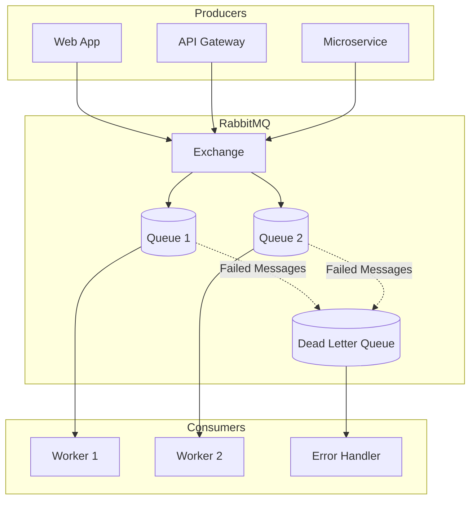

# RabbitMQ Overview 🐇📦

RabbitMQ is a open source distributed message broker that works like a post office in the cloud. It acts as a middleman: producers send messages, RabbitMQ routes them, and consumers process them.

# 📖 What is RabbitMQ?

**Message Broker**: Stores and forwards messages between applications.

**Protocol**: Built on AMQP (Advanced Message Queuing Protocol).

**Features**:

-**Reliable delivery** (acknowledgments, retries, dead-letter queues).

-**Flexible routing** (direct, topic, fanout exchanges).

-**Asynchronous processing** (decouples producers and consumers).

-**Scalable** (multiple consumers can process in parallel).

# 🔑 Use Cases

-**E-commerce Order Processing** → Orders, payments, inventory updates handled by separate services.

-**Background Jobs** → Email sending, image processing, report generation.

-**Real-time Notifications** → Social media alerts, chat messages.

-**IoT Data Collection** → Devices publish sensor data, analytics services consume.

-**Microservices Communication** → Decouples services for scalability.

-**Gaming Systems** → Multiplayer games broadcast player actions/events.

flowchart LR
    Producer --> Exchange --> Queue --> Consumer
    subgraph RabbitMQ
        Exchange
        Queue
    end

### 📦 A comprehensive guide to building robust message-driven applications with RabbitMQ and Go

[Features](#-key-features) • [Quick Start](#-quick-start) • [Tutorials](#-tutorials) • [Architecture](#-architecture) • [Contributing](#-contributing)

---

## 🌟 Key Features

- ✅ **Complete RabbitMQ Tutorial Series** - From Hello World to Advanced Patterns
- ✅ **Production Ready Code** - Error handling, reconnection logic, best practices
- ✅ **Docker Support** - Easy setup with docker-compose
- ✅ **Advanced Patterns** - Dead Letter Queues, Priority Queues, RPC
- ✅ **Real-world Use Cases** - Microservices, Task Distribution, Event-driven Architecture

---

## 📊 Architecture Overview

# 🚀 Quick Start
# Prerequisites

    # Install Go 1.21+
    go version
    
    # Install Docker
    docker --version
    
    # Clone repository
    git clone https://github.com/Ashraful52038/RabbitMq.git
    cd RabbitMq

# Start RabbitMQ with Docker

    # Using docker-compose (recommended)
    docker-compose up -d
    
    # Or using docker run
    docker run -d \
      --name rabbitmq \
      -p 5672:5672 \
      -p 15672:15672 \
      -e RABBITMQ_DEFAULT_USER=admin \
      -e RABBITMQ_DEFAULT_PASS=admin \
      rabbitmq:management

# Verify Installation

    # Check if RabbitMQ is running
    docker ps | grep rabbitmq
    
    # Access Management UI
    open http://localhost:15672  # Username: admin, Password: admin

# 📚 Tutorials
## Level 1: Fundamentals
classDiagram
    class HelloWorld {
        Description: Basic publish/subscribe
        Code: View Code
        Concepts: Connection, Channel, Queue
    }

    class WorkQueues {
        Description: Distribute tasks among workers
        Code: View Code
        Concepts: Round-robin, ACK, Durability
    }

    HelloWorld <|-- Fundamentals
    WorkQueues <|-- Fundamentals

    
sequenceDiagram
    participant P as Producer
    participant Q as Queue
    participant W1 as Worker_1
    participant W2 as Worker_2

    P->>Q: Publish Task 1
    P->>Q: Publish Task 2
    Q->>W1: Deliver Task 1
    Q->>W2: Deliver Task 2
    W1-->>Q: Acknowledge Task 1
    W2-->>Q: Acknowledge Task 2

## Level 2: Exchange Patterns

classDiagram
    class PublishSubscribe {
        Description: Broadcast to all queues
        Code: View Code
        Exchange Type: Fanout
    }

    class Routing {
        Description: Selective message routing
        Code: View Code
        Exchange Type: Direct
    }

    class Topics {
        Description: Pattern-based routing
        Code: View Code
        Exchange Type: Topic
    }

    PublishSubscribe <|-- ExchangePatterns
    Routing <|-- ExchangePatterns
    Topics <|-- ExchangePatterns

    

Happy Coding! 🚀
