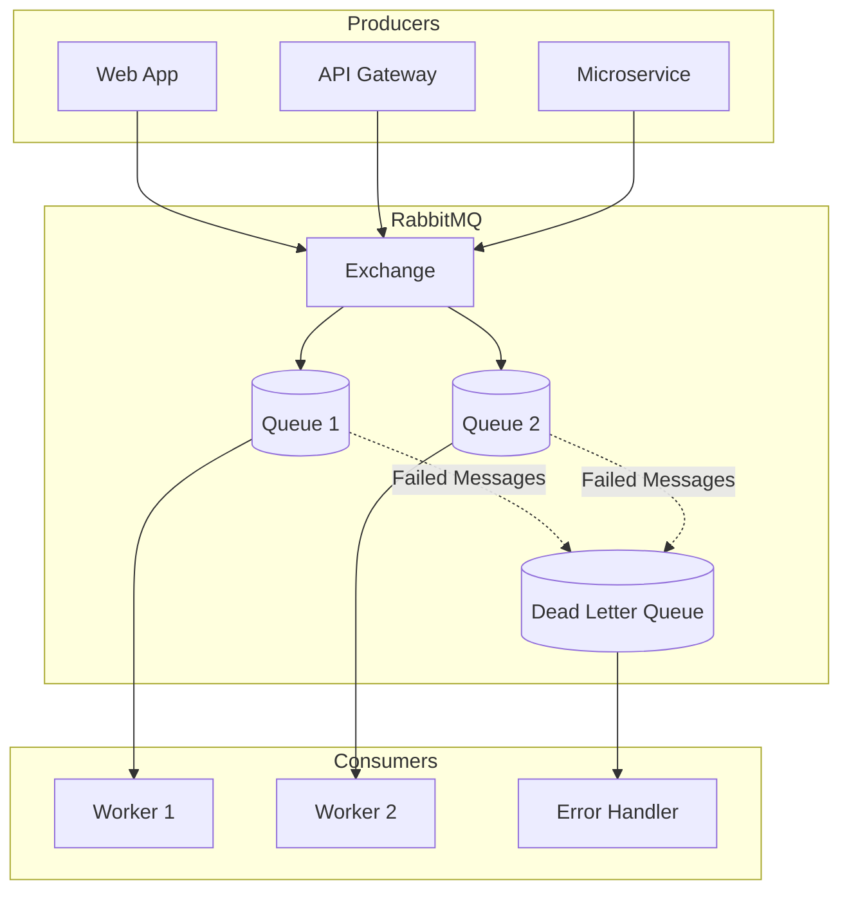

# RabbitMQ Overview 🐇📦

RabbitMQ is a open source distributed message broker that works like a post office in the cloud. It acts as a middleman: producers send messages, RabbitMQ routes them, and consumers process them.

# 📖 What is RabbitMQ?

Message Broker: Stores and forwards messages between applications.

Protocol: Built on AMQP (Advanced Message Queuing Protocol).

Features:

    Reliable delivery (acknowledgments, retries, dead-letter queues).

    Flexible routing (direct, topic, fanout exchanges).

    Asynchronous processing (decouples producers and consumers).

    Scalable (multiple consumers can process in parallel).

# 🔑 Use Cases

E-commerce Order Processing → Orders, payments, inventory updates handled by separate services.

Background Jobs → Email sending, image processing, report generation.

Real-time Notifications → Social media alerts, chat messages.

IoT Data Collection → Devices publish sensor data, analytics services consume.

Microservices Communication → Decouples services for scalability.

Gaming Systems → Multiplayer games broadcast player actions/events.

flowchart LR
    Producer --> Exchange --> Queue --> Consumer
    subgraph RabbitMQ
        Exchange
        Queue
    end

### 📦 A comprehensive guide to building robust message-driven applications with RabbitMQ and Go

[Features](#-key-features) • [Quick Start](#-quick-start) • [Tutorials](#-tutorials) • [Architecture](#-architecture) • [Contributing](#-contributing)

---

## 🌟 Key Features

- ✅ **Complete RabbitMQ Tutorial Series** - From Hello World to Advanced Patterns
- ✅ **Production Ready Code** - Error handling, reconnection logic, best practices
- ✅ **Docker Support** - Easy setup with docker-compose
- ✅ **Advanced Patterns** - Dead Letter Queues, Priority Queues, RPC
- ✅ **Real-world Use Cases** - Microservices, Task Distribution, Event-driven Architecture

---

## 📊 Architecture Overview

# 🚀 Quick Start
# Prerequisites

    # Install Go 1.21+
    go version
    
    # Install Docker
    docker --version
    
    # Clone repository
    git clone https://github.com/Ashraful52038/RabbitMq.git
    cd RabbitMq

# Start RabbitMQ with Docker

    # Using docker-compose (recommended)
    docker-compose up -d
    
    # Or using docker run
    docker run -d \
      --name rabbitmq \
      -p 5672:5672 \
      -p 15672:15672 \
      -e RABBITMQ_DEFAULT_USER=admin \
      -e RABBITMQ_DEFAULT_PASS=admin \
      rabbitmq:management

# Verify Installation

    # Check if RabbitMQ is running
    docker ps | grep rabbitmq
    
    # Access Management UI
    open http://localhost:15672  # Username: admin, Password: admin

# 📚 Tutorials
# Level 1: Fundamentals
graph TD
    A[Level 1: Fundamentals] --> B[Hello World]
    A --> C[Work Queues]

    B --> D[Description: Basic publish/subscribe]
    B --> E[Code: View Code]
    B --> F[Concepts: Connection, Channel, Queue]

    C --> G[Description: Distribute tasks among workers]
    C --> H[Code: View Code]
    C --> I[Concepts: Round-robin, ACK, Durability]
    
sequenceDiagram
    participant P as Producer
    participant Q as Queue
    participant W1 as Worker 1
    participant W2 as Worker 2
    
    P->>Q: Publish Task 1
    P->>Q: Publish Task 2
    Q->>W1: Deliver Task 1
    Q->>W2: Deliver Task 2
    W1-->>Q: Acknowledge
    W2-->>Q: Acknowledge

    
# 🐰 RabbitMQ with Go - Complete Production-ready Guide

https://img.shields.io/badge/RabbitMQ-FF6600?style=for-the-badge&logo=rabbitmq&logoColor=white
https://img.shields.io/badge/Go-00ADD8?style=for-the-badge&logo=go&logoColor=white
https://img.shields.io/badge/Docker-2496ED?style=for-the-badge&logo=docker&logoColor=white

📚 Complete RabbitMQ Tutorial Series in Go

This repository contains practical implementations of RabbitMQ official tutorials in Go. Each tutorial is explained step by step and designed for real-world use cases.

📋 Tutorial Index
#	Tutorial	Concept	Folder
1	Hello World	Single producer & consumer	rabbitmq-go-example
2	Work Queues	Task distribution, Round-robin	rabbitmq-work-queues
3	Publish/Subscribe	Fanout Exchange, Broadcast	rabbitmq-pub-sub
4	Routing	Direct Exchange, Severity-based filtering	rabbitmq-routing
5	Topics	Topic Exchange, Pattern matching (wildcard)	rabbitmq-topics
6	RPC	Remote Procedure Call, Request-Reply pattern	rabbitmq-rpc
🚀 Quick Start
Prerequisites:

    Go 1.21+

    Docker

    Git

Start RabbitMQ Docker Container:
bash

docker run -d --name rabbitmq -p 5672:5672 -p 15672:15672 rabbitmq:management

Run a Tutorial:
bash

cd rabbitmq-work-queues
go mod tidy
go run cmd/worker/main.go     # Terminal 1
go run cmd/new_task/main.go "Hello World"   # Terminal 2

📖 Detailed Tutorials
Tutorial 1: Hello World

    Concept: RabbitMQ basics

    What you'll learn: Connection, Channel, Queue Declare, Publish, Consume

    Folder: rabbitmq-go-example/

Tutorial 2: Work Queues

    Concept: Task distribution

    What you'll learn: Round-robin dispatching, Message acknowledgment, Durability, Fair dispatch

    Folder: rabbitmq-work-queues/

Tutorial 3: Publish/Subscribe

    Concept: Fanout Exchange

    What you'll learn: Exchange declare, Temporary queue, Binding, Broadcast

    Folder: rabbitmq-pub-sub/

Tutorial 4: Routing

    Concept: Direct Exchange

    What you'll learn: Routing key, Severity-based filtering, Multiple bindings

    Folder: rabbitmq-routing/

Tutorial 5: Topics

    Concept: Topic Exchange

    What you'll learn: Pattern matching, Wildcards (* and #)

    Folder: rabbitmq-topics/

Tutorial 6: RPC

    Concept: Remote Procedure Call

    What you'll learn: Callback queue, Correlation ID, Request-Reply pattern

    Folder: rabbitmq-rpc/

🎯 Key Concepts Learned
Exchange Types
Type	Routing Logic	Use Case
Fanout	Broadcast to all queues	Broadcast logging
Direct	Exact match on routing key	Severity based logging
Topic	Pattern match (wildcard)	Facility + severity based logging
Headers	Based on header attributes	Complex routing (rarely used)
Advanced Features
Feature	Description	Use Case
Dead Letter Exchange (DLX)	Destination for failed/expired messages	Retry mechanism, Error handling
Priority Queue	Process urgent tasks first	VIP requests, Critical tasks
Acknowledgement (ACK)	Confirmation of task completion	Message loss prevention
QoS Prefetch	Control message distribution	Fair dispatch
Key Properties
Property	Purpose
durable	Queue survives broker restart
exclusive	Queue deleted when connection closes
auto-delete	Queue deleted when last consumer unsubscribes
persistent	Message saved to disk
📁 Folder Structure
text

RabbitMq/
├── README.md
├── rabbitmq-go-example/        # Tutorial 1: Hello World
│   └── cmd/
│       ├── publisher/
│       └── consumer/
├── rabbitmq-work-queues/       # Tutorial 2: Work Queues
│   └── cmd/
│       ├── worker/
│       └── new_task/
├── rabbitmq-pub-sub/           # Tutorial 3: Publish/Subscribe
│   └── cmd/
│       ├── emit_log/
│       └── receive_logs/
├── rabbitmq-routing/           # Tutorial 4: Routing
│   └── cmd/
│       ├── emit_log_direct/
│       └── receive_logs_direct/
├── rabbitmq-topics/            # Tutorial 5: Topics
│   └── cmd/
│       ├── emit_log_topic/
│       └── receive_logs_topic/
└── rabbitmq-rpc/               # Tutorial 6: RPC
    └── cmd/
        ├── rpc_server/
        └── rpc_client/

🛠️ Troubleshooting
Docker Permission Issue
bash

sudo usermod -aG docker $USER
newgrp docker

Port Already in Use
bash

sudo lsof -i :5672
sudo systemctl stop rabbitmq-server 2>/dev/null

Useful Commands
bash

# View RabbitMQ queues
docker exec -it rabbitmq rabbitmqctl list_queues

# View bindings
docker exec -it rabbitmq rabbitmqctl list_bindings

# View exchanges
docker exec -it rabbitmq rabbitmqctl list_exchanges

# View RabbitMQ logs
docker logs rabbitmq

🌐 Useful Links

    RabbitMQ Official Website

    RabbitMQ Documentation

    Go RabbitMQ Client (amqp091-go)

    RabbitMQ Tutorials

📝 License

This project is created for educational purposes. Released under MIT License.
👨‍💻 Contact

    GitHub: @Ashraful52038

    RabbitMQ Community: RabbitMQ Discord

Happy Coding! 🚀
