# RabbitMQ Overview 🐇📦

RabbitMQ is a open source distributed message broker that works like a post office in the cloud. It acts as a middleman: producers send messages, RabbitMQ routes them, and consumers process them.

# 📖 What is RabbitMQ?

**Message Broker**: Stores and forwards messages between applications.

**Protocol**: Built on AMQP (Advanced Message Queuing Protocol).

**Features**:

-**Reliable delivery** (acknowledgments, retries, dead-letter queues).

-**Flexible routing** (direct, topic, fanout exchanges).

-**Asynchronous processing** (decouples producers and consumers).

-**Scalable** (multiple consumers can process in parallel).

# 🔑 Use Cases

-**E-commerce Order Processing** → Orders, payments, inventory updates handled by separate services.

-**Background Jobs** → Email sending, image processing, report generation.

-**Real-time Notifications** → Social media alerts, chat messages.

-**IoT Data Collection** → Devices publish sensor data, analytics services consume.

-**Microservices Communication** → Decouples services for scalability.

-**Gaming Systems** → Multiplayer games broadcast player actions/events.

flowchart LR
    Producer --> Exchange --> Queue --> Consumer
    subgraph RabbitMQ
        Exchange
        Queue
    end

<div align="center">

[](https://www.rabbitmq.com/)
[](https://golang.org/)
[](https://www.docker.com/)
[](https://opensource.org/licenses/MIT)
[](http://makeapullrequest.com)

### 📦 A comprehensive guide to building robust message-driven applications with RabbitMQ and Go

[Features](#-key-features) • [Quick Start](#-quick-start) • [Tutorials](#-tutorials) • [Architecture](#-architecture) • [Contributing](#-contributing)

</div>

---

## 🌟 Key Features

- ✅ **Complete RabbitMQ Tutorial Series** - From Hello World to Advanced Patterns
- ✅ **Production Ready Code** - Error handling, reconnection logic, best practices
- ✅ **Docker Support** - Easy setup with docker-compose
- ✅ **Advanced Patterns** - Dead Letter Queues, Priority Queues, RPC
- ✅ **Real-world Use Cases** - Microservices, Task Distribution, Event-driven Architecture

---

## 📊 Architecture Overview


# 🚀 Quick Start
# Prerequisites

    # Install Go 1.21+
    go version
    
    # Install Docker
    docker --version
    
    # Clone repository
    git clone https://github.com/Ashraful52038/RabbitMq.git
    cd RabbitMq

# Start RabbitMQ with Docker

    # Using docker-compose (recommended)
    docker-compose up -d
    
    # Or using docker run
    docker run -d \
      --name rabbitmq \
      -p 5672:5672 \
      -p 15672:15672 \
      -e RABBITMQ_DEFAULT_USER=admin \
      -e RABBITMQ_DEFAULT_PASS=admin \
      rabbitmq:management

# Verify Installation

    # Check if RabbitMQ is running
    docker ps | grep rabbitmq
    
    # Access Management UI
    open http://localhost:15672  # Username: admin, Password: admin

# 📚 Tutorials
## Level 1: Fundamentals
```mermaid
classDiagram
    class HelloWorld {
        Description: Basic publish/subscribe
        Code: View Code
        Concepts: Connection, Channel, Queue
    }

    class WorkQueues {
        Description: Distribute tasks among workers
        Code: View Code
        Concepts: Round-robin, ACK, Durability
    }

    HelloWorld <|-- Fundamentals
    WorkQueues <|-- Fundamentals

    
sequenceDiagram
    participant P as Producer
    participant Q as Queue
    participant W1 as Worker_1
    participant W2 as Worker_2

    P->>Q: Publish Task 1
    P->>Q: Publish Task 2
    Q->>W1: Deliver Task 1
    Q->>W2: Deliver Task 2
    W1-->>Q: Acknowledge Task 1
    W2-->>Q: Acknowledge Task 2
```

## Level 2: Exchange Patterns


## Level 2: Exchange Patterns
```mermaid
classDiagram
    class PublishSubscribe {
        Description: Broadcast to all queues
        Code: View Code
        Exchange Type: Fanout
    }

    class Routing {
        Description: Selective message routing
        Code: View Code
        Exchange Type: Direct
    }

    class Topics {
        Description: Pattern-based routing
        Code: View Code
        Exchange Type: Topic
    }

    PublishSubscribe <|-- ExchangePatterns
    Routing <|-- ExchangePatterns
    Topics <|-- ExchangePatterns

graph LR
    subgraph "Topic Exchange Example"
        P[Producer] --> TE{Topic Exchange}
        TE -->|"*.critical.*"| Q1[Critical Queue]
        TE -->|"log.*"| Q2[Log Queue]
        TE -->|"*.warning"| Q3[Warning Queue]
    end
```

## Level 3: Advanced Patterns


🔧 RPC (Remote Procedure Call) Configuration
What is RPC Pattern?

RPC allows you to call a function on a remote server and wait for the result, just like a local function call.

RPC Architecture Diagram

sequenceDiagram
    participant Client
    participant CallbackQ as Callback Queue
    participant RequestQ as Request Queue (rpc_queue)
    participant Server
    
    Client->>RequestQ: 1. Send Request + reply_to + correlation_id
    Note over Client,RequestQ: reply_to: callback_queue<br/>correlation_id: unique-123
    RequestQ->>Server: 2. Deliver Request
    Server->>Server: 3. Process Request (fibonacci)
    Server->>CallbackQ: 4. Send Response + correlation_id
    CallbackQ->>Client: 5. Deliver Response
    Note over Client: Match response<br/>using correlation_id

RPC Configuration Parameters
Parameter	Description	Example	Purpose
reply_to	Callback queue name	amq.rabbitmq.reply-to	Where server sends response
correlation_id	Unique request ID	UUID v4	Match request with response
rpc_queue	Request queue name	rpc_queue	Where requests are sent
Prefetch Count	QoS setting	1	Fair dispatch
Timeout	Processing timeout	5s	Prevent hanging requests
AutoAck	Manual acknowledgment	false	Reliable processing


# 🔧 Advanced Features Implementation
## 1. Dead Letter Exchange (DLX)

    // Configure queue with DLX
    queueArgs := amqp.Table{
        "x-dead-letter-exchange":    "dlx.exchange",
        "x-dead-letter-routing-key": "dlx-routing-key",
        "x-message-ttl":             30000, // 30 seconds
    }
    
    queue, err := ch.QueueDeclare(
        "main.queue",
        true,  // durable
        false, // auto-delete
        false, // exclusive
        false, // no-wait
        queueArgs,
    )


## 2. Priority Queue
    // Enable priorities (0-10)
    queueArgs := amqp.Table{
        "x-max-priority": 10,
    }
    
    // Publish with priority
    msg := amqp.Publishing{
        Body:     []byte("Urgent message"),
        Priority: 9, // Higher priority = processed first
    }
## 3. Manual Acknowledgment
    msgs, err := ch.Consume(
        queue.Name,
        "",
        false, // auto-ack = false (manual mode)
        false,
        false,
        false,
        nil,
    )
    
    for d := range msgs {
        err := processMessage(d.Body)
        if err == nil {
            d.Ack(false) // Acknowledge success
        } else {
            d.Nack(false, false) // Reject, don't requeue
        }
    }

# 📦 Project Structure

```mermaid
graph TD
    A[📁 RabbitMq] --> B[docker-compose.yml]
    A --> C[📁 rabbitmq-go-example]
    A --> D[📁 rabbitmq-work-queues]
    A --> E[📁 rabbitmq-pub-sub]
    A --> F[📁 rabbitmq-routing]
    A --> G[📁 rabbitmq-topics]
    A --> H[📁 rabbitmq-rpc]

    C --> C1[📁 cmd]
    C1 --> C2[publisher]
    C1 --> C3[consumer]
    C --> C4[README.md]

    D --> D1[📁 cmd]
    D1 --> D2[worker]
    D1 --> D3[new_task]
    D --> D4[README.md]

    E --> E1[📁 cmd]
    E1 --> E2[emit_log]
    E1 --> E3[receive_logs]
    E --> E4[README.md]

    F --> F1[📁 cmd]
    F1 --> F2[emit_log_direct]
    F1 --> F3[receive_logs_direct]
    F --> F4[README.md]

    G --> G1[📁 cmd]
    G1 --> G2[emit_log_topic]
    G1 --> G3[receive_logs_topic]
    G --> G4[README.md]

    H --> H1[📁 cmd]
    H1 --> H2[rpc_server]
    H1 --> H3[rpc_client]
    H --> H4[README.md]
```


# 🛠️ Docker Compose Setup

**Create a docker-compose.yml file:

    version: '3.8'
    
    services:
      rabbitmq:
        image: rabbitmq:3-management
        container_name: rabbitmq
        hostname: rabbitmq
        ports:
          - "5672:5672"   # AMQP protocol
          - "15672:15672" # Management UI
          - "15692:15692" # Prometheus metrics
        environment:
          RABBITMQ_DEFAULT_USER: admin
          RABBITMQ_DEFAULT_PASS: admin
          RABBITMQ_DEFAULT_VHOST: /
        volumes:
          - rabbitmq_data:/var/lib/rabbitmq
          - rabbitmq_log:/var/log/rabbitmq
        networks:
          - rabbitmq_network
        healthcheck:
          test: ["CMD", "rabbitmq-diagnostics", "ping"]
          interval: 30s
          timeout: 10s
          retries: 5
    
    volumes:
      rabbitmq_data:
      rabbitmq_log:
    
    networks:
      rabbitmq_network:
        driver: bridge


# 🧪 Testing
    bash
    
    # Run all tests
    go test ./...
    
    # Run specific tutorial tests
    cd rabbitmq-work-queues
    go test -v ./...
    
    # Load testing
    go test -bench=. ./...

# 📈 Monitoring & Management

Access RabbitMQ Management UI:

    URL: http://localhost:15672

    Username: admin

    Password: admin

## Useful Commands
    bash
    
    # List queues
    docker exec rabbitmq rabbitmqctl list_queues
    
    # List exchanges
    docker exec rabbitmq rabbitmqctl list_exchanges
    
    # List bindings
    docker exec rabbitmq rabbitmqctl list_bindings
    
    # Check cluster status
    docker exec rabbitmq rabbitmqctl cluster_status
    
    # View logs
    docker logs -f rabbitmq

## 🤝 Contributing

Contributions are welcome! Please feel free to submit a Pull Request.

    Fork the repository

    Create your feature branch (git checkout -b feature/AmazingFeature)

    Commit your changes (git commit -m 'Add some AmazingFeature')

    Push to the branch (git push origin feature/AmazingFeature)

    Open a Pull Request

## 📝 License

This project is licensed under the MIT License - see the LICENSE file for details.
👨‍💻 Author

**Ashraful Islam**

    GitHub: @Ashraful52038

    LinkedIn: Ashraful Islam

## 🙏 Acknowledgments

    RabbitMQ Team for amazing message broker

    Go RabbitMQ Client contributors

    All contributors and users of this tutorial series

<div align="center">
⭐ If you find this useful, please star the repository!

https://img.shields.io/github/stars/Ashraful52038/RabbitMq?style=social
https://img.shields.io/github/forks/Ashraful52038/RabbitMq?style=social
https://img.shields.io/twitter/follow/ashraful?style=social

Happy Coding! 🚀
</div> EOF ```
